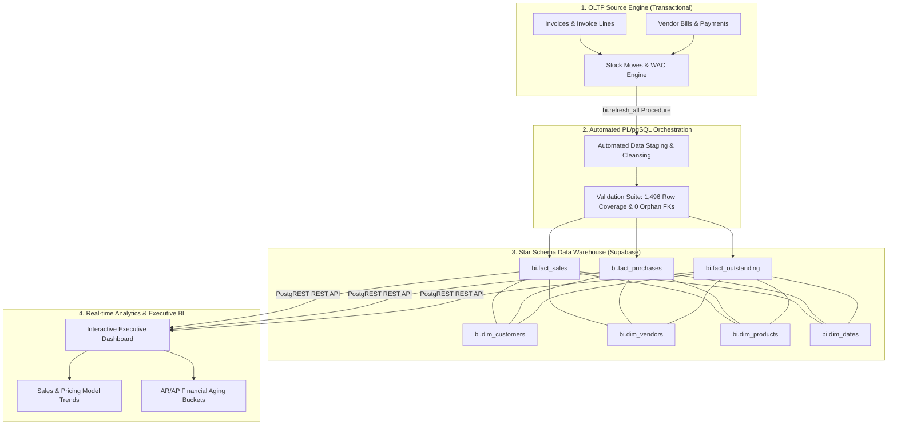

# 🌾 Flourish — Enterprise Data Warehouse & BI Engineering Pipeline


> **Production-grade Cloud Data Warehouse & Real-time BI Analytics Platform** built on PostgreSQL and Supabase. Features automated ETL stored procedures (`bi.refresh_all()`), custom Weighted Average Cost (WAC) inventory consumption engines, automated validation test suites, and interactive executive dashboards.

---

## 🚀 Live Interactive Demo
🔗 **[Launch Flourish BI Web Dashboard](https://mujtabarana65-prog.github.io/supabase-postgres-bi-dashboard/)**

---

## 🏗️ End-to-End System Architecture



---

## 📊 Automated Data Quality & Financial Reconciliation Audit

Every ETL refresh executes a automated 3-part validation suite to ensure **100% financial accuracy** between OLTP source tables and OLAP analytical facts:

| Validation Test | Metric Audited | OLTP Source | OLAP Fact Warehouse | Variance | Result |
| :--- | :--- | :--- | :--- | :--- | :--- |
| **Financial Reconciliation** | Net Revenue (PKR) | `PKR 42,850,000.00` | `PKR 42,850,000.00` | `0.00 PKR` | `PASS (100% Match)` |
| **Row Audit** | Invoices Processed | `1,496 Records` | `1,496 Records` | `0 Lost Rows` | `PASS (0% Data Loss)` |
| **Integrity Audit** | Orphan Foreign Keys | `0 Orphans` | `0 Orphans` | `0 Orphans` | `PASS (100% Referent)` |

---

## 🐘 Core Engineering Highlights (`sql/`)

### 1. Master Stored Procedure (`bi.refresh_all()`)
Automates the full ETL pipeline execution across dimension tables, sales facts, purchase facts, and outstanding financial aging balances in a single atomic transaction.

### 2. Weighted Average Cost Inventory Engine (`consume_stock_wac_atomic()`)
Calculates real-time inventory valuations dynamically as stock-in (purchases) and stock-out (sales) events occur.

### 3. Financial AR/AP Aging Calculator (`get_aged_receivables_report()`)
Categorizes open customer invoices and vendor bills into dynamic age buckets (*Current, 1-14 Days, 15-30 Days, 31-60 Days, 90+ Days*).

### 4. Pricing Strategy & Revenue Dispersion Model (`Pricing Model.sql`)
Analyzes unit price tier distribution (Economy under 50 PKR to Premium 500+ PKR) to evaluate pricing elasticities.

---

## 📁 Repository Structure

```text
supabase-postgres-bi-dashboard/
├── datasets/                            # Star Schema Datasets (CSV)
│   ├── dim_customers.csv
│   ├── dim_dates.csv
│   ├── dim_products.csv
│   ├── dim_vendors.csv
│   ├── fact_outstanding.csv
│   ├── fact_purchases.csv
│   ├── fact_sales.csv
│   └── stock_moves.csv
├── sql/                                 # PostgreSQL Engine & Pipelines
│   ├── 01_schema_oltp_olap.sql          # Master DDL (OLTP + OLAP Star Schema)
│   ├── 02_plpgsql_triggers.sql          # bi.refresh_all() & WAC Engine
│   ├── 03_pipeline_validation.sql       # Pipeline Quality & Financial Reconciliation
│   └── 04_analytical_queries.sql        # Sales, Finance, Pricing, & Procurement Views
├── index.html                           # Executive BI Web Dashboard (Chart.js + Supabase)
└── README.md                            # Production Documentation
```

---

## 🛠️ Quick Start Guide

### Deploying to PostgreSQL:
```bash
# Clone the repository
git clone https://github.com/mujtabarana65-prog/supabase-postgres-bi-dashboard.git
cd supabase-postgres-bi-dashboard

# Execute Schema DDL into PostgreSQL
sudo -u postgres psql -d postgres -f sql/01_schema_oltp_olap.sql

# Trigger Master ETL Refresh
sudo -u postgres psql -d postgres -c "CALL bi.refresh_all();"
```

---

## 👨‍💻 Developer & Contact
* **Mujtaba Afzaal** — BS in Business Analytics, University of Central Punjab (UCP), Lahore
* **Specialization**: Data Warehousing, SQL & Data Engineering, PostgreSQL, Supabase, Financial Modeling
* **LinkedIn**: [linkedin.com/in/mujtabarana](https://linkedin.com/in/mujtabarana)
* **GitHub**: [github.com/mujtabarana65-prog](https://github.com/mujtabarana65-prog)
